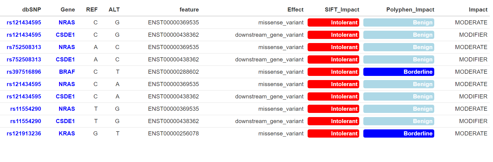

  


# VariantFinder_SurvivalKM 


**Arguments** | **Description**
-----|-----
patient|is the data.frame of the patient clinical data downloaded from MMRF-Commpass Researcher Gateway 
trt|is the data.frame of the patient clinical data (i.e. treatment-response) downloaded from MMRF-Commpass Researcher Gateway 
variant.ann| is the data.frame of the annotated variants downloaded from MMRF-Commpass Researcher Gateway
Listvariant| is the list of the variants to analyze
[FilterBy](#FilterBy)| Column with groups to plot. This is a mandatory field.
risk.table| show or not the risk table
expand| show or not an expanded plot
legend| Legend title of the figure
xlim| x axis limits e.g. xlim = c(0, 1000). Present narrower X axis, but not affect survival estimates.
main| main title of the plot
labels| labels of the plot
ylab| y axis text of the plot
xlab| x axis text of the plot
filename| The name of the pdf file.
color| Define the colors/Pallete for lines.
width| Image width
height| Image height
pvalue| show p-value of log-rank test
conf.range|  show confidence intervals for point estimates of survival curves.
dpi| Figure quality


## Survival Curves in the Stratified Patients Cohort

The KM survival curves are drawn with respect to the <a name="FilterBy">FilterBy</a> parameter that can be set for stratifying the patients cohort into the categories shown in the following Table:


**Arguments** | **Description**
-----|-----
Ethnicity | Ethnicity 
Stage | ISS Stage
Treatment |  Treatment class
Bestresp |  Best overall response
Gender |  Female or Male
Effect |  Effect Type of observed mutation
Biotype |  Gene biotype


<div class="panel panel-warning">
<div class="panel-heading"><a name="Datasets">Example</a> </div>
<div class="panel-body">

<p align="justify">The following plots show the KM survival curves for each variant (i.e. dbSNP ID) in "ListSNPs_NRAS" (we focus on NRAS gene) with respect to the:<br>

- treatment (i.e. Therapy class)<br>
- Stage <br>
- Bestresp <br>
- Ethnicity.<br>

Note that Only the KM curves with pvalue$<$0.05 are shown.
For simplification purposes, we take into account only the top five SNPs by occurrence.</p>


<div class="panel panel-info">
<div class="panel-heading"><a name="Datasets">Example</a> </div>
<div class="panel-body">


<!--# TREATMENT-->

```{r results = 'hide', message=FALSE, warning=FALSE, eval = F}
NRAS_SNPs<-head(ListSNPs_NRAS,5) #["rs2157615","rs61731685","rs370560636","rs116293337"]

surv<-VariantFinder_SurvivalKM(patient,  
                              trt,
                              variant.ann,
                              NRAS_SNPs,
                              FilterBy="Treatment", 
                              filename=NULL,
                              xlim = c(100,3000),
                              conf.range = FALSE,
                              color = c("Dark2"))


```


```{r figurename2, echo=FALSE, fig.cap="KM survival curves are drawn for each SNP found in the NRAS gene in the case of the FilterBy parameter is set to Treatment", out.width = '99%'}
knitr::include_graphics("imgs/KM_Surv_treatment.png")
```
</div>
</div>

<!--# STAGE-->


<div class="panel panel-info">
<div class="panel-heading"><b>Resulting plot</b></div>
<div class="panel-body">


```{r results = 'hide', message=FALSE, warning=FALSE, eval = F}
NRAS_SNPs<-head(ListSNPs_NRAS,5) #["rs2157615","rs61731685","rs370560636","rs116293337"]

surv<-VariantFinder_SurvivalKM(patient,  
                              trt,
                              variant.ann,
                              NRAS_SNPs,
                              FilterBy="Stage", 
                              filename=NULL,
                              xlim = c(100,3000),
                              conf.range = FALSE,
                              color = c("Dark2"))


```


```{r figurename3, echo=FALSE, fig.cap="KM survival curves are drawn for each SNP found in the NRAS gene in the case of the FilterBy parameter is set to Stage", out.width = '50%'}

```

</div>
</div>

<!--# ETHNICITY-->


<div class="panel panel-info">
<div class="panel-heading"><b>Resulting plot</b></div>
<div class="panel-body">

```{r results = 'hide', message=FALSE, warning=FALSE, eval = F}
NRAS_SNPs<-head(ListSNPs_NRAS,5) #["rs2157615","rs61731685","rs370560636","rs116293337"]

surv<-VariantFinder_SurvivalKM(patient,  
                              trt,
                              variant.ann,
                              NRAS_SNPs,
                              FilterBy="Ethnicity", 
                              filename=NULL,
                              xlim = c(100,3000),
                              conf.range = FALSE,
                              color = c("Dark2"))


```


```{r figurename4, echo=FALSE, fig.cap="KM survival curves are drawn for each SNP found in the NRAS gene in the case of the FilterBy parameter is set to Ethnicity", out.width = '99%'}

```
</div>
</div>


<!--# BESTRESP-->

<div class="panel panel-info">
<div class="panel-heading"><b>Resulting plot</b></div>
<div class="panel-body">

```{r results = 'hide', message=FALSE, warning=FALSE, eval = F}
NRAS_SNPs<-head(ListSNPs_NRAS,5) #["rs2157615","rs61731685","rs370560636","rs116293337"]

surv<-VariantFinder_SurvivalKM(patient,  
                              trt,
                              variant.ann,
                              NRAS_SNPs,
                              FilterBy="Bestresp", 
                              filename=NULL,
                              xlim = c(100,3000),
                              conf.range = FALSE,
                              color = c("Dark2"))


```


```{r figurename5, echo=FALSE, fig.cap="KM survival curves are drawn for each SNP found in the NRAS gene in the case of the FilterBy parameter is set to Bestresp", out.width = '99%'}
knitr::include_graphics("imgs/KM_Surv_Bestresp.png")
```
</div>
</div>


</div>
</div>


# VariantFinder_GetImpact 


**Arguments** | **Description**
-----|-----
variant.ann| is the data.frame of the annotated variants downloaded from MMRF-Commpass Researcher Gateway
ListSNPs| is the list of the variants to analyze


<div class="panel panel-warning">
<div class="panel-heading"><b>Example</b></div>
<div class="panel-body">


```{r results = 'hide', message=FALSE, warning=FALSE, eval = F}

ListSNPs<-c("rs755588843","rs200556051","rs745587729","rs2066497","rs760494041")

impact.table<-VariantFinder_GetImpact(variant.ann,ListSNPs)
```


```{r figurename6, echo=FALSE, fig.cap="The table shows the VariantFinder_GetImpact output. ", out.width = '99%'}

```
</div>
</div>

