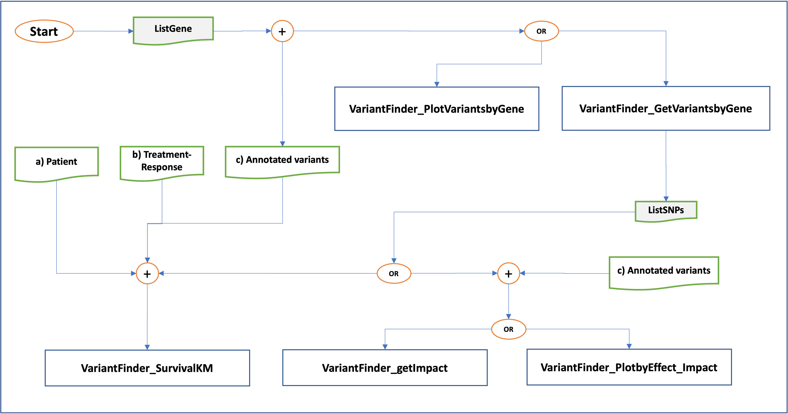

```{r, include = FALSE}
knitr::opts_chunk$set(
  collapse = TRUE,
  warning=FALSE, 
  message=FALSE,
  comment = "#>"
)
```

# VariantFinder Use-Case
For a more intuitive interpretation of the results, VariantFinder provides a graphical or tabular representation of the outputs.
The use-case diagram shown below provides an overview of the VariantFinder functionalities and the different scenarios that can be performed.

```{r figurename2, echo=FALSE, fig.cap="Use-case diagram that represents the high-level functionalities of VariantFinder", out.width = '99%'}

```


# Required libraries

```{r setup}
library(VariantFinder)
library(dplyr)
library(DT)
library(ggplot2)
library(stringr)
library(ggpubr)
library(survminer)
library(survival)
library(formattable)
```


```{r, echo = FALSE,hide=TRUE, message=FALSE,warning=FALSE}
devtools::load_all(".")
```

```{r message=FALSE, warning=FALSE, include=FALSE}
library(dplyr)
library(DT)
library(ggplot2)
library(stringr)
library(ggpubr)
```


# Download and Install

To install this package, start R (version "4.0.0") and enter: 
```R
devtools::install_github("marziasettino/VariantFinder", build_vignettes = TRUE)
library(VariantFinder)
```


   
# <b>VariantFinder Functions</b>


The following Figure shows the VariantFinder functions and their input/outp. The first two columns show respectively
the category (Column ”Cat.”) to which the function belongs and the name of the
function. The two latter columns show the input and output of the functions. If the input
is labelled with
∗
the input is not mandatory. The labels (a),(b),(c) at the column ”Input”
refer to the datasets described in the following Section [VariantFinder Datasets](#Datasets)


```{r figurename8, echo=FALSE, fig.cap="VariantFinder Functions", out.width = '99%'}

```


# VariantFinder Datasets


<p align="justify">
MMRF-CoMMpass data can be retrieved directly from [MMRF-Commpass Researcher Gateway](https://research.themmrf.org/). They can be downloaded and imported as a dataframe into R environment.
</p>


VariantFinder deals with the IA15 dataset (GRCh37 reference
genome), which represents the fifteen release of the complete
baseline, available in a flat file format (i.e. csv/txt) at the
MMRF-RG. 


With regard to the structure of IA15, it incorporates the following datasets:<br><br>


<div class="panel panel-warning">
<div class="panel-heading"><a name="Datasets">VariantFinder Datasets</a> </div>
<div class="panel-body">


- **MMRF_CoMMpass_IA15_PER_PATIENT**: contains patient-clinical data such as demographic (e.g.
age, gender, race, ethnicity) and cytogenetics (e.g. FISH
results) information beside of the ISS disease stage for each
patient;<br>
- **MMRF_CoMMpass_IA15_STAND_ALONE_TRTRESP**: contains the treatment-response information for each
patient;<br>
- **MMRF_CoMMpass_IA15a_All_Canonical_Variants**: contains the variants annotations including the impact and effect beside of the SIFT and Polyphen2 scores and the
dbSNP Identifiers (IDs). <br>


</div>
</div>

## Fetching and importing MMRF-COMMPASS datasets

VariantFinder requires a local copy of the MMRFCoMMpass
datasets that can be downloaded from the MMRF-RG
by the registered users. Once the datasets have been
downloaded, they can be saved locally in a tab-delimited text
file format for importing them into the R environment as described below.


```{r results = 'hide', message=FALSE, warning=FALSE, eval = F}
patient <- read.csv("~/MMRF_CoMMpass_IA15_PER_PATIENT")

trt <- read.csv("~/MMRF_CoMMpass_IA15_STAND_ALONE_TRTRESP")

variant.ann <- read.csv("~/MMRF_CoMMpass_IA15a_All_Canonical_Variants")
```
<br>

</div>
</div>


# Testing VariantFinder functions
  


<p align="justify">
In order to test the VariantFinder functions (without fetch MMRF-CoMMpass data from MMRF-RG), three fictitious datasets are provided in the "data" directory:<br>

- <variant.ann.example> <br>
- <patient.example> <br>
- <trt.example> <br>

They replicate the original datasets format including only some fileds with respect to MMRF-CoMMpass datasets (.csv files) downloaded from MMRF-COMMPASS Research Gateway. 
</p>

<div class="panel panel-info">
<div class="panel-heading"><b>Annotated variant dataframe</b></div>
<div class="panel-body">


```{r  echo=TRUE, message=FALSE, warning=FALSE}
datatable(variant.ann.example,options = list(scrollX = TRUE, keys = TRUE))
```

</div>
</div>

<div class="panel panel-info">
<div class="panel-heading"><b>Patient dataframe</b></div>
<div class="panel-body">

```{r  echo=TRUE, message=FALSE, warning=FALSE}
datatable(patient.example,options = list(scrollX = TRUE, keys = TRUE))
```

</div>
</div>


<div class="panel panel-info">
<div class="panel-heading"><b>Treatment dataframe</b></div>
<div class="panel-body">

```{r  echo=TRUE, message=FALSE, warning=FALSE}
datatable(trt.example,options = list(scrollX = TRUE, keys = TRUE))
```
</div>
</div>
# Question and issues
<hr>
Please use [Github issues](https://github.com/marziasettino/VariantFinder/issues) if you want to file bug reports or feature requests.


# Session Information
******
```{r sessionInfo}
sessionInfo()
```
